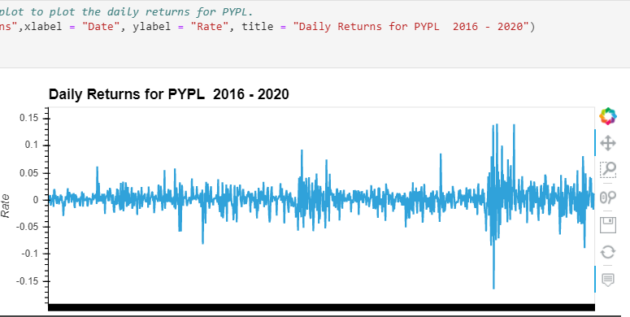
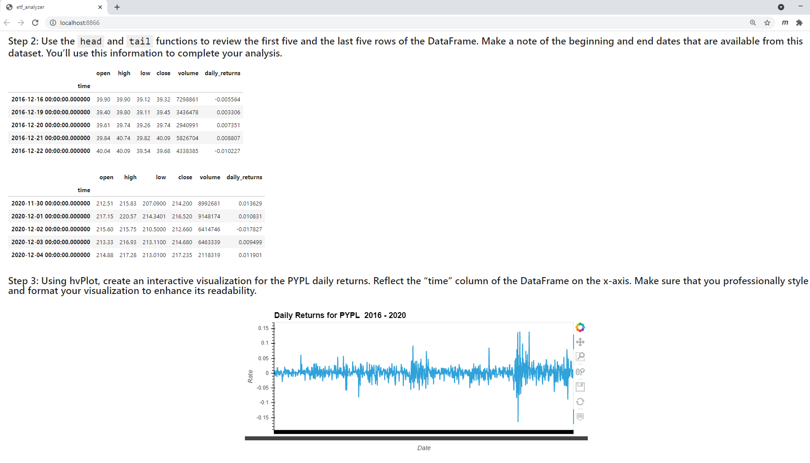
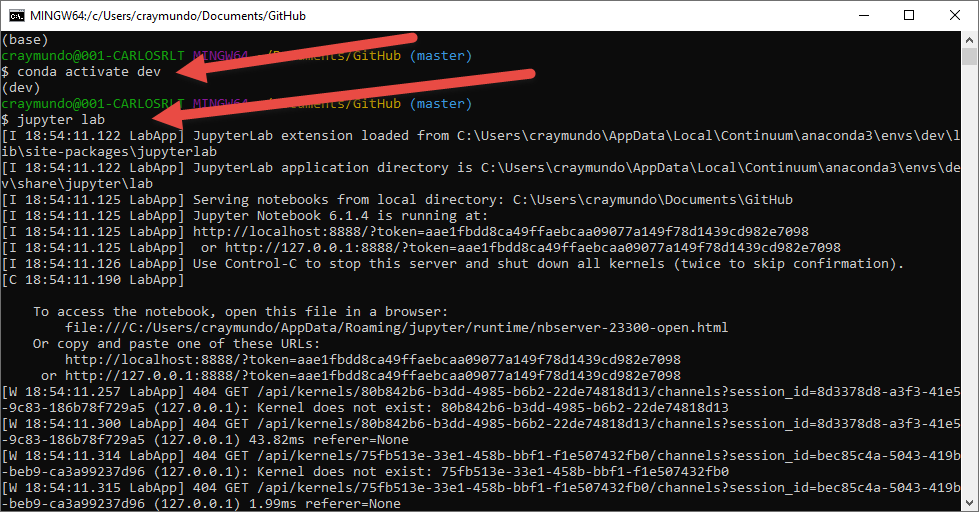

# Web Application EFT Analyzer
This is a single Jupiter Notebook that uses numpy, pandas, hvplot.pandas, sqlalchemy and voila modules to analyze an EFT portfolio composed by 4 stock tickers. The notebook is configured to retrieve data from a database called eft.db using sqlalchemy.  Subsequently, the filtered information gets to concatenated into DataFrames using pandas.  Then ultimately, the data findings get plotted in hvplot.pandas Notebook as well as web applicaton using voila.


---


## Technologies

This project leverages python 3.7 with the following packages:

* [Pandas](https://pandas.pydata.org/docs/user_guide/visualization.html) - For the command line interface, help page, and entrypoint.

* [JupyterLab](http://jupyterlab.io/) - For interactive user workspace that utilizes Notebook.

* [Numpy](https://numpy.org/doc/stable/reference/generated/numpy.sqrt.html) - NumPy sqrt function. Return the non-negative square-root of an array, element-wise. The values whose square-roots are required.

* [matplotlib](https://plotly.com/python/px-arguments/) - Plotly Express Arguments in Python.

* [sqlalchemy](https://www.sqlalchemy.org/) - a library that facilitates the communication between Python programs and databases.

* [voila](https://voila.readthedocs.io/en/stable/) - turns Jupyter notebooks into standalone web applications.


---

## Installation Guide

Before running the application first install the following dependencies.


* [Git Bash (Windows) or Terminal (macOS)] (https://git-scm.com/downloads) -  

* [Anaconda with Python 3.7] (https://docs.anaconda.com/anaconda/install/) - 

* [installing the Requests library] (conda install -c anaconda requests)

* [install SQLAlchemy] ( pip install SQLAlchemy )

* [install voila] (conda install -c conda-forge voila )

--- 

---

## Examples

This section includes screenshots of few plots that can easily by running this notebook or running Viola and diplay the entire notebook as a web application.

- Plotting a chart illustrating PYPL ticker Daily Returns from Notebook.


- This is an illustration of how the Notebook gets to be display as a Web application using Viola.



---

## Usage

To use AnalyzingPortfolioRisk-Profit book simply clone the repository and run "Git Bash" with:

```
- Start by activating an Anaconda Environment instance.
- Then follow by starting Jupyter Lab

```
Upon launching the loan qualifier application you will be greeted with the following prompts.


---

## Contributors

Brought to you by Carlos R. you may reach me at reachcarlostoday@gmail.com

---

## License

MIT.